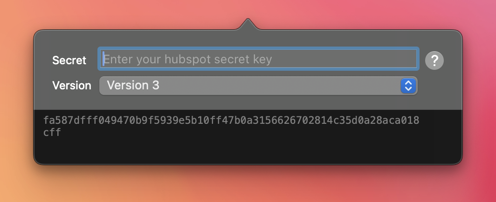
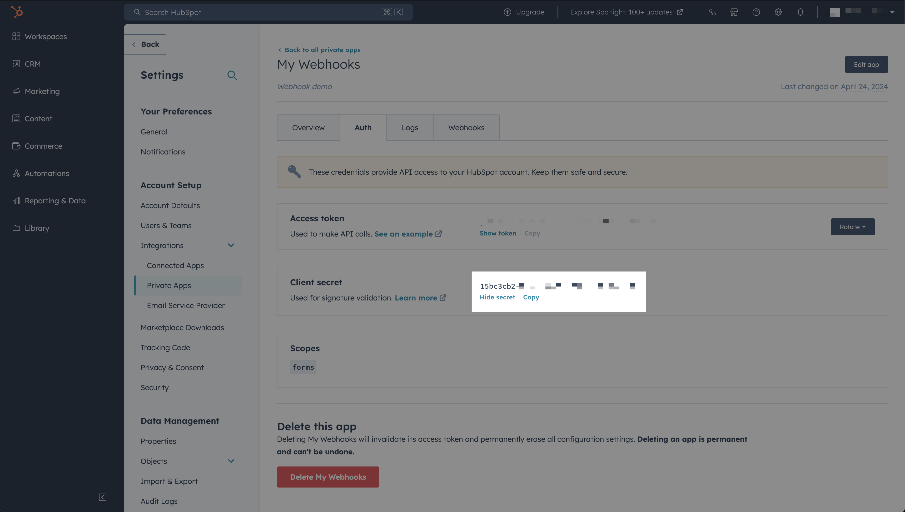
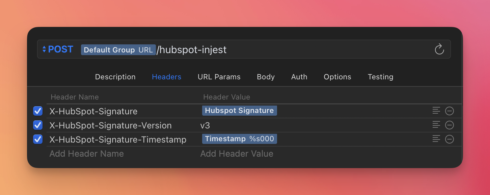
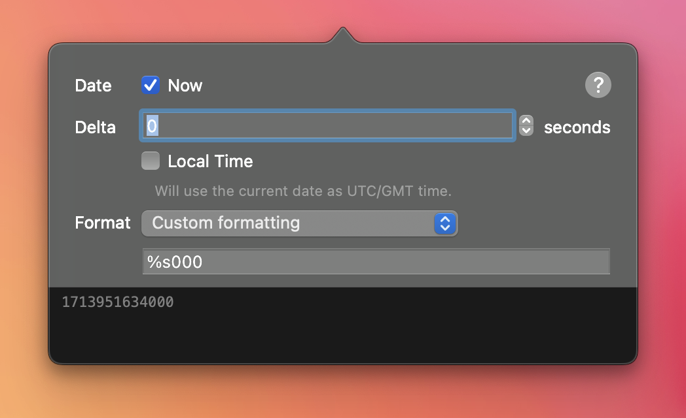

# Paw / Rapid API Hubspot Signature Extension

This extension creates the same signatures that hubspot uses to sign their webhooks. This extension is useful for verifying that the payload sent to your server is from Hubspot and not a malicious actor.

# Installation

1. Open Rapid API
2. Go to Rapid API > Extensions > Open Extensions Directory
3. Create a folder in that directory called `com.hatchhead.HubspotSignature`
3. Put the contents of this repo in that folder (technically you only need the `HubspotSignature.js` file)

> We can't find a way to submit this extension to the Rapid API library. If you know how, please let us know via a github issue.

# Configuration

### Secret

The secret is used to sign the payload sent by Hubspot. This is used to verify the payload was sent by Hubspot and not a malicious actor. You can find the secret in your Hubspot's apps or your workflow's settings.

### Version

Hubspot has multiple versions of their webhook API signatures. This extension supports version 1, 2, and 3. The version is used to determine how the payload is signed.

You can set version manually or use the `X-HubSpot-Signature-Version header value` option to have the extension determine the version based on the X-HubSpot-Signature-Version.

#### Important note when using Version 3

Configuration: Version 1 and 2 signatures pass the signature in the `X-HubSpot-Signature` header but when using Version 3, the signature is passed in the `X-HubSpot-Signature-v3` header so your API will have to handle both situations. The extension does not throw errors if you have the wrong header set but your server should respond accordingly.

You will also need to pass a `X-HubSpot-Signature-Timestamp` header to verify the signature. We recommend using the Values > Timestamp > Custom Formatting dynamic value with a format of `%s000` to mimic the timestamp format Hubspot uses. If you do not have this header present, then the extension cannot generate a valid signature and will throw an error.

Since version 3 is the latest most secure, we recommend using it if possible. According to the [Hubspot Docs](https://developers.hubspot.com/docs/api/webhooks/validating-requests#validate-the-v3-request-signature), your server should fail if the timestamp is older than 5 minutes. You can simulate this with a delta of -301 seconds (60 * 5 + 1 ).

# Error handling

If your configuration is not correct, the extension will return an error message as the value.